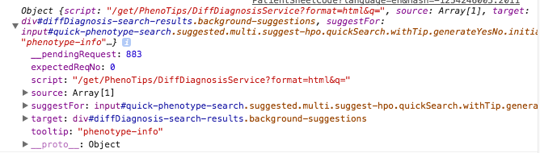

__TODO__

1. finish reading javascript the definitive guide
2. refresh on d3js syntax
3.

__Planning__

[PT-2783]( https://phenotips.atlassian.net/browse/PT-2783)

_General_

+ redesign diagnosis suggestion  
+ viewable in both view and edit mode   
  + what/how view change in view/edit mode  
+ allow turning on/off phenotypes to refine suggestion
+ architecture
  + BACKEND  
    + Diagnosis-suggestions/DiseasePredictService
      + fetch omim for initial selection
    + what updates view after deselecting a symptom?
  + FRONTEND
    + Instant Omim search

_Details_

+ instantiate new d3 canvas at `responseReceived`
  + remove old d3 canvas
  + requires a dom element with unique id
    + add `div#instant-search-diagram` between `div#defaultSearchTerms` and `.background-search .omim-search` in `UIX_Field_\_omim_suggestions.xml`  
+ create a `MatrixDiagram` class
  + data processing
    + data structure
      +


__Resources__


 [XWiki](http://www.xwiki.org/xwiki/bin/view/Main/Documentation)  
[_java servlet_](https://en.wikipedia.org/wiki/Java_servlet)
  +
[_JSP_](https://en.wikipedia.org/wiki/JavaServer_Pages)
  +
[_Apache Velocity_](http://velocity.apache.org/engine/devel/developer-guide.html)
+ a Java-based templating engine to reference objects defined in Java    

[_Apache Tomcat_](http://tomcat.apache.org/tomcat-7.0-doc/appdev/index.html)   
[_prototype.js_](http://api.prototypejs.org/) and [_tutorial_](http://www.tutorialspoint.com/prototype/prototype_element_toggleclassname.htm)  
[_Velocity under XWiki_](http://platform.xwiki.org/xwiki/bin/view/DevGuide/XWikiVelocityTraining)
[xWiki front end API](http://platform.xwiki.org/xwiki/bin/view/DevGuide/JavaScriptAPI)  
[Les Misérables Co-occurrence Matrix](https://bost.ocks.org/mike/miserables/) and [json](https://bost.ocks.org/mike/miserables/miserables.json) used
[_XWiki java doc_](http://nexus.xwiki.org/nexus/service/local/repositories/releases/archive/org/xwiki/platform/xwiki-platform-oldcore/6.4.2/xwiki-platform-oldcore-6.4.2-javadoc.jar/!/index.html?com/xpn/xwiki/web/class-use/XWikiServletResponse.html)   
  + [XWikiServletResponse](http://nexus.xwiki.org/nexus/service/local/repositories/releases/archive/org/xwiki/platform/xwiki-platform-oldcore/6.4.2/xwiki-platform-oldcore-6.4.2-javadoc.jar/!/index.html?com/xpn/xwiki/web/class-use/XWikiServletResponse.html)
  +  

[_Javax.servlet doc_](http://docs.oracle.com/javaee/6/api/javax/servlet/package-summary.html)
[_Jacax.inject doc_](http://docs.oracle.com/javaee/6/api/javax/inject/package-summary.html)  


__FAQ__

[how to mangrep](http://askubuntu.com/questions/464302/how-to-find-specific-switch-in-man-page)  
[Apache Velocity $ vs $!{}](http://stackoverflow.com/questions/1978061/apache-velocity-vs)
[why should you not use >, <, & in xml ](http://stackoverflow.com/questions/6322126/whats-the-big-deal-with-using-the-lt-instead-of-simply-to-do-comparison)  
[Observable Xwiki Events doc](http://platform.xwiki.org/xwiki/bin/view/DevGuide/JavaScriptAPI)
[An explanation on dependency injection](http://www.javaworld.com/article/2071914/excellent-explanation-of-dependency-injection--inversion-of-control-.html) and [beginner's guide](http://www.theserverside.com/news/1321158/A-beginners-guide-to-Dependency-Injection)  
[How to write XWiki Component](http://platform.xwiki.org/xwiki/bin/view/DevGuide/WritingComponents)   
[XWiki scripting module](http://extensions.xwiki.org/xwiki/bin/view/Extension/Script+Module)  
[How to return JSON from Velocity](http://snippets.xwiki.org/xwiki/bin/view/Extension/Output+JSON)


__Architecture__

DiagnosisScriptService
+ API that connects velocity and Java  
  + by importing `org.xwiki.component.annotation.Component` -- [_doc_](http://platform.xwiki.org/xwiki/bin/view/DevGuide/WritingComponents)
    + `@Role` for declaring service of current component
    + `Component` for declaring a component implementation
    + `@Named()` for specifying component hint, to distinguish between several implementation of same type  
    + _component.txt_ specifies component implementation
  +   
      ```
      @Inject
      private DiagnosisService service;
      ```
      injects component `DiagnosisService`
+ To make Component accessible to wiki pages
  + writing a `ScriptService` implementation, i.e. `implements ScriptService`
    + `org.xwiki.script.service.ScriptService` -- [_doc_](http://extensions.xwiki.org/xwiki/bin/view/Extension/Script+Module)  
  + access a `@Named("diagnosis")` class with a `get()` method in scripting languages
    + in velocity with `services.diagnosis.get()`


VocabularyTerm ([_source_](https://github.com/phenotips/phenotips/blob/dd204fcf8fc9c7f4b32c34886a8c38740f288bd1/components/vocabularies/api/src/main/java/org/phenotips/vocabulary/VocabularyTerm.java))
+ `public interface`
  + for _mim_ and _hp_ accessions
+ MIM schama [here](https://github.com/phenotips/phenotips/blob/master/components/vocabularies/omim/api/src/main/resources/omim/conf/schema.xml)
+ HPO schema [here](https://github.com/phenotips/phenotips/blob/master/components/vocabularies/hpo/api/src/main/resources/hpo/conf/schema.xml)  


UIX_Field_\_omim_suggestions.xml  ([_source_](https://github.com/phenotips/phenotips/blob/master/components/patient-data/ui/src/main/resources/PhenoTips/UIX_Field__omim_suggestions.xml) and [_edit_](http://localhost:8080/edit/PhenoTips/UIX_Field__omim_suggestions?editor=object))
+ is the frontend view template for _Instant OMIM Search_ Area    
+ renders `class = "ncbi-search-box"`   
  + `class='ncbi-search-box-content'`
    + `id="defaultSearchTermsInput"` displays phenotypes already selected  
    + `class="background-search omim-search"`  
      + `id="omim-search-results"  class="background-suggestions"` displays and updates predicted omim entries in the form of list.  
+ `$services.localization.render('phenotips.UIXField.diagnosisSuggestions.omimSearch.Hint')` imports implementation configs and renders to headers/texts from [_.properties file_](https://github.com/phenotips/phenotips/search?utf8=%E2%9C%93&q=phenotips.UIXField.diagnosisSuggestions), this is perhaps to create abstraction so as to facilitate language translation.
+ __question__ why initiate `{{html}}` halfway through [here](https://github.com/phenotips/phenotips/blob/master/components/patient-data/ui/src/main/resources/PhenoTips/UIX_Field__omim_suggestions.xml#L120)  
+ [macros](https://github.com/phenotips/phenotips/blob/b457ad5cf296c8b9871e7fbf61da10b5e9bbada9/components/patient-data/ui/src/main/resources/PhenoTips/PatientSheetMacros.xml) are included in these xml files


PatientSheetCode.xml#L2402 ([_source_](https://github.com/phenotips/phenotips/blob/master/components/patient-data/ui/src/main/resources/PhenoTips/PatientSheetCode.xml#L2402) and [_edit_]())
+ Instant searches in the Diagnosis zone
  + creates services that dispatch events to backend
    + DiseasePredictService     
    + DiffDiagnosisService    
  + symptoms were stored in `value` property of `defaultSearchTermsInput` and `defaultSearchTermIDsInput`
  + `updateSearchValue`  
    + extract innerHTML of element `search-term` and store both ID and terms of HPO in `defaultSearchTermIDsInput` and `defaultSearchTermsInput`  
    + fire `phenotips:phenotypeChanged` event if symptoms listed are changed somehow  
    + call `doSearch()`
  + `doSearch` basically construct ajax request
    + `data` is a property of `service` variable and holds reference for creating the Ajax request
    + create `parameters` by sorting symptoms to two categories
      + 
    + create `queryString` as a space-separated stirng of HPO keys from `data.source`, which represents DOM element `#input.defaultSearchTermIDsInput`
    + `data.__pendingRequest` instantiates `Ajax.Updater`, whose `onCreate`, `onSuccess`, `onComplete` call other functions using `Function.bind(this, data)`, where `data` passes on to `service` as the first parameter in the referenced functions.
      + GET request to `DiseasePredictService` and `DiffDiagnosisService`
  + `updateDone`
    + handles returned html elements  
    + `idElt.title` stores OMIM ID for the disease
  + `document.observe('global-phenotype-meta:selected, callback)`
    + dunno what this is about
  + `document.observe('xwiki:dom:loaded', callback)` populates `cache` after every round
    + loops through all element with `.yes-no-picker` and
      + identify `key`, or HPO, and `text`, or symptom from yes-no-picker
      + store `obj`, or symptom form current yes-no-picker, to `cache.all` if `.na input` is unchecked  
      + `obj.hidden` is set to `false` since `na` is unchecked
      + `obj.type` is set to `not_symptom` or `symptom` depending on if `noInput` is checked or not  
      + if `.na input` is checked, `obj.hidden` is set to true, and if `obj` is previously selected, meaning stored in `cache.all`, it is then deleted from `cache.displayed`
  + `cache` Object
    + 
  + `service` Object
    + 
      + `script` stands for Ajax URL
      + `source` stands for `input#defaultSearchTermIDsInput`, where query ID will be extracted
      + `target` stands for container to be updated
        + i.e. `diffDiagnnosis-search-results`
      + `suggestFor` refers to `input#quick-phenotype-search`


Specificity-meter/SpecificityMetricWidget.xml
+ frontend creating the template for the specificity meter
+ listen to events, fire ajax request, and update views

Specificity-meter/SpecificityMetricWidgetServcie.xml
+ backend handles GET request
+ computes and returns a JSON specifying score....


Diagnosis-suggestions/DiseasePredictService   
+ backend for diagnosis suggestion
+ `$request`
  + [XWikiServletResponse](http://nexus.xwiki.org/nexus/service/local/repositories/releases/archive/org/xwiki/platform/xwiki-platform-oldcore/6.4.2/xwiki-platform-oldcore-6.4.2-javadoc.jar/!/index.html?com/xpn/xwiki/web/class-use/XWikiServletResponse.html) or [`Javax.servlet.ServletRequest`](http://docs.oracle.com/javaee/6/api/javax/servlet/ServletRequest.html)
  + attributes  
    + `getContentType()`
      + `text/plain;charset=UTF-8`  
    + `q`
      + HPO terms i.e. `HP:0010301 HP:0001332`
    + limit
    + reqNo
    + `request.getParameterValues('symptom')`   
      + array of symptoms
    + `request.getParameterValues('free_symptom')`  
      + array of free symptoms
+ `$services.diagnosis`
  + is calling `org.phenotips.diagnosis.script.DiagnosisScriptService([], [], int)`   
  + `$result` is the result from `services.diagnosis.get($symptoms, $freeSymptoms, $limit)`
+ Generate HTML response listing OMIM terms


__Velocity__


```
(% class='foo' %)         # renders to <p></p>  
(% class='foo' %)((()))   # renders to <div></div>  
(% class="foo"%)bar(%%)   # renders to <span></span>  
```  


__Prototypejs__

+ `$(id)` is same as `document.getElementById(id)`   
+ `$$` is a CSS selector
+ `Element.select(element, expression)` returns child element with matching expression
+ `Enumerable.each` [here](http://prototypejs.org/doc/latest/language/Enumerable/prototype/each/)
+ `Element.down(element, expression)` [here](http://prototypejs.org/doc/latest/dom/Element/down/) returns first descendent of element that matches expression
+ `Element.update(element, newContent) -> element` updates and returns element
+ `Element.insert(element)` [here](http://prototypejs.org/doc/latest/language/Enumerable/prototype/each/) inserts element to Element    
+ `Element.observe(element, eventname, handler)` [here](http://prototypejs.org/doc/latest/dom/Event/observe/) registers an event handler on a DOM element.  
+ `Element.up(expression, index)`  [here](http://prototypejs.org/doc/latest/dom/Element/up/) returns nth ancestors of selected element. This is similar to `Element.down(expression, index)`   
+ `Ajax.Updater` [here](http://prototypejs.org/doc/latest/ajax/Ajax/Updater/) performs ajax request and updates container with content of response

```
new Ajax.Updater('items', '/items', {
  parameters: { text: $F('text') }
});
```

+ `String.strip` [here](http://prototypejs.org/doc/latest/language/String/prototype/strip/) Strips all leading and trailing whitespace from a string.

__Javascript__

+ `Function.prototype.bind()` [here](https://developer.mozilla.org/en/docs/Web/JavaScript/Reference/Global_objects/Function/bind) The `bind()` method creates a new function that, when called, has its `this` keyword set to the provided value, with a given sequence of arguments preceding any provided when the new function is called.


__questions__


1. $('prefix').value is `PatientClass_0_`, which seems to be an accessor for patient specific data.


```
var omimField = $('prefix') && $($('prefix').value + 'omim_id');
```

It is generated by XWiki. Just used to store data and access them.


2. what does [this](https://github.com/phenotips/phenotips/blob/master/components/patient-data/ui/src/main/resources/PhenoTips/PatientSheetCode.xml#L2413) do

```
'script' : new XWiki.Document('DiseasePredictService', 'PhenoTips').getURL('get', 'format=html') + "&q=",
```

Creates URL for Ajax get request


3. how does [this](https://github.com/phenotips/phenotips/blob/master/components/patient-data/ui/src/main/resources/PhenoTips/PatientSheetCode.xml#L2590) work

`data.target.__initialized`
 is set to `true` whenever the data.target gets attached to a widget.

4. what is the difference between `cache.all` and `cache.displayed`

`cache` stores data for symptoms.

5. how does `bind` work in this [context](https://github.com/phenotips/phenotips/blob/master/components/patient-data/ui/src/main/resources/PhenoTips/PatientSheetCode.xml#L2627)


6. where does `YesNoPicker` originate from [code](https://github.com/phenotips/phenotips/blob/master/components/patient-data/ui/src/main/resources/PhenoTips/PatientSheetCode.xml#L2401)   


7. want to get a rough idea of what `updatedDone` actually does  

8. what does `  document.observe('xwiki:dom:loaded', callback)` actually do

9. why there are input classes that store data (i.e. id and name of symptom)?


10. benefit of using prototypejs, is it because of `Class.create()` but whats wrong with Javascript `prototype`
